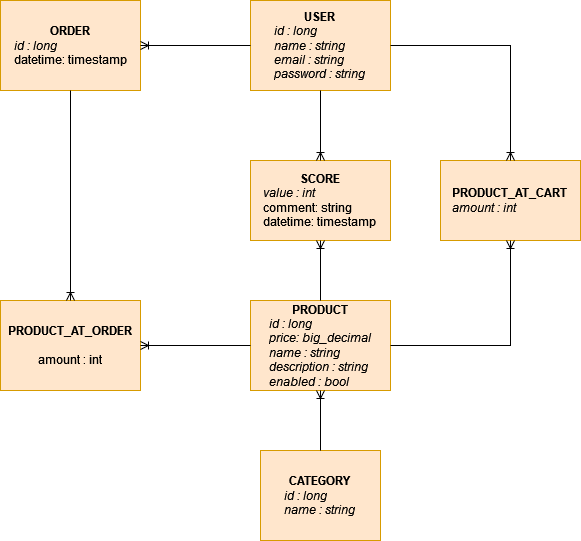

# nnpia-semestral-work

## Data Model

## BACKEND

### PRODUCTS
| Operation | Path | Parameters | Body | Description |
| --- | --- | --- | --- | --- |
| `POST`   | /products | | price, name, description, image | Create new product |
| `GET`    | /products | pageNumber, pageSize, sortBy| | Get all products |
| `GET`    | /products/***{id}*** | | | Get specific product |
| `PUT`    | /products/***{id}*** | | price, name, description, image | Update specific product |
| `DELETE` | /products/***{id}*** | | | Delete specific product |

### CATEGORY
| Operation | Path | Parameters | Body | Description |
| --- | --- | --- | --- | --- |
| `POST`   | /category | | name | Create new category |
| `GET`    | /category | | | Get all categories |
| `GET`    | /category/***{id}*** | | | Get specific category |
| `PUT`    | /category/***{id}*** | | name | Update specific category |
| `DELETE` | /category/***{id}*** | | | Delete specific category |

### USERS
| Operation | Path | Parameters | Body | Description |
| --- | --- | --- | --- | --- |
| `POST`   | /users | | name, email, password | Create new user |
| `GET`    | /users | | | Get all users |
| `GET`    | /users/***{id}*** | | | Get specific user |
| `GET`    | /users/logged | | | Get logged user |
| `PUT`    | /users/***{id}*** | | name, email, password | Update specific user |
| `PUT`    | /users/logged | | name, email, password | Update logged user |
| `DELETE` | /users/***{id}*** | | | Delete specific user |

### SCORE
| Operation | Path | Parameters | Body | Description |
| --- | --- | --- | --- | --- |
| `POST`   | /score | | value, productId | Create new score of specific product and logged user|
| `GET`    | /score | productId | | Get all scores of specific product or get all scores as default |
| `GET`    | /score/***{userId}***/***{productId}*** | | | Get specific score |
| `PUT`    | /score | | value, productId | Update specific score of product and logged user |
| `DELETE` | /score/***{userId}***/***{productId}*** | | | Delete specific score |

### CART
| Operation | Path | Parameters | Body | Description |
| --- | --- | --- | --- | --- |
| `POST`   | /cart | | amount, comment, productId | Create new product in cart for logged user |
| `GET`    | /cart | | | Get all products in cart of logged user |
| `GET`    | /cart/***{userId}***/***{productId}*** | | | Get specific product in cart |
| `PUT`    | /cart | | amount, comment, productId | Update specific product in cart of logged user |
| `DELETE` | /cart | | productId | Delete specific product in cart of logged user |

## FRONTEND
